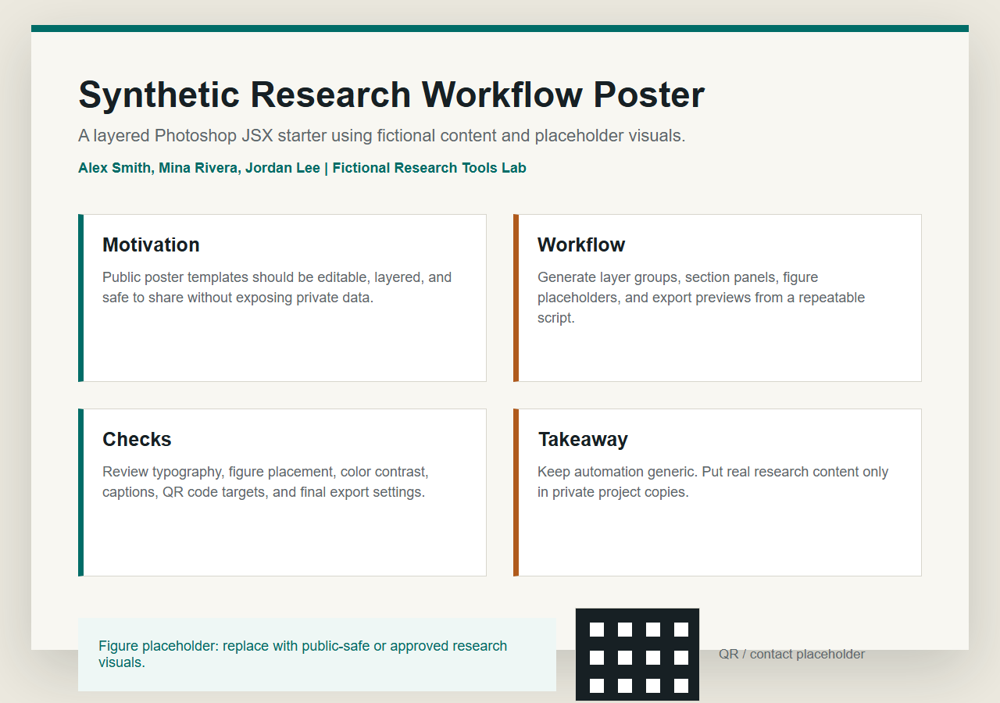

# Photoshop Layered Poster JSX Starter

A public-safe Adobe Photoshop JSX starter for generating a structured, layered research-poster layout with editable text, section groups, figure placeholders, and export helpers.

It is intended as a clean starting point for design automation experiments, not as a finished conference poster or a private poster workflow dump.



## What It Includes

- `jsx/create_layered_poster.jsx`: creates a layered poster document in Photoshop.
- `jsx/export_flat_preview.jsx`: exports a flattened PNG preview from the active document.
- `templates/poster-layout.json`: public-safe source layout data.
- `preview/poster-preview.html`: browser preview of the same synthetic layout.
- Validation tests and public-asset scan.

## Quick Start

1. Open Adobe Photoshop.
2. Run `File > Scripts > Browse...`.
3. Select `jsx/create_layered_poster.jsx`.
4. Review and edit the generated layers.
5. Run `jsx/export_flat_preview.jsx` if you want a flattened PNG preview.

Validate the public repo:

```powershell
python -m unittest discover -s tests
python scripts\validate_public_assets.py
```

## Privacy Boundary

The checked-in layout is fictional. It does not represent a real conference poster, thesis figure, lab result, manuscript, company material, paid design asset, or private workflow.

Do not commit `.psd`, `.psb`, unpublished figures, real QR codes, real portraits, paid fonts, or private conference drafts.

## Suggested GitHub Topics

```text
photoshop
jsx
extendscript
poster
research-tools
design-automation
academic-writing
adobe
template
automation
```
